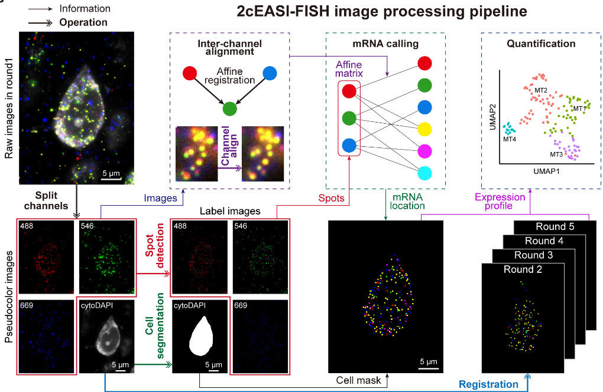

# 2cEASI-FISH-analysis
2cEASI-FISH was developed to integrate multimodal data from individual cortical projection neurons. The pipeline starts with raw light-sheet microscopy images and processes them for downstream analysis.

This image processing pipeline includes the following steps:

## Step 0: Split Channels
- Use *SplitChannels.py* to split 4D microscopy images (C, Z, Y, X) into individual 3D channel volumes.
> **Channel 1**: cytoDAPI; **Channel 2**: 488nm; **Channel 3**: 546nm; **Channel 4**: 649nm

## Step 1: Cell Segmentation
- Cell and nucleus masks are generated from cytoDAPI (Channel 1) using *CellSegmentation.py* （a downsampled **Cellpose** (cyto2) segmentation (https://github.com/MouseLand/cellpose)）
- followed by manual label alignment and quality-controlled correction where necessary. 

## Step 2: Spot Detection
- In addition to Channel 1, puncta in other channels (488 nm, 546 nm, and 649 nm) are detected using **AIRLOCALIZE** (https://github.com/timotheelionnet/AIRLOCALIZE/) for channel-specific spot identification.
- Batch processing of images is performed using *Batch_AL.m* and the configuration file *Pars.ini*. 
- *vis* can helps to visualize puncta
## Step 3: Affine Registration
- To align multi-channel imaging data (e.g., 488 nm and 647 nm channels) to a common reference channel (546 nm), we used ANTs(Advanced Normalization Tools)(https://github.com/ANTsX/ANTs)(*antsRegistration*) with translation and affine transformations.
- Submit the job using slurm
```{shell}
sbatch ./Step3_AffineRegistration/Affine_Reg_v2.sh
```
- Generate transformation matrix output *xxx0GenericAffine.mat* to transform detected spots.

> **Note** Steps 1–3 can be parallelized to accelerate processing.

## Step 4: Channel Alignment
- Use *Batch_SpotLocsTrans_AdaptThresh.m* to apply transformation matrix in the 3D detected spot coordinates
- ouput:*_ch1_Z7_AlignCh.csv*,*_ch2_Z7_AlignCh.csv*,*_ch3_Z7_AlignCh.csv*

## Step 5: mRNA Calling
mRNA puncta are assigned based on dual-color colocalization (≤660 nm), with ambiguous cases resolved by 3D overlap optimization and triple-channel colocalized signals excluded as autofluorescence.
- Use *Batch_Vis_Spots_7Color_50x_AdaptThresh.m* to generate *xx_lbCode_All.tif* for mRNA Calling
- Use *Batch_Extract_FISH_GeneExp_CoLoc_2Ch.m* to assign gene puncta

## Step 6: Normalization and Downstream Analysis
Normalized expression of Gene *i* in Neuron *j* was calculated as:

$$
 G_{norm}(i,j) = \frac{G_{raw}(i,j)}{V_j\times{Avg\_Eef2\_Nbhd}}
$$

where:
- $G_{\text{raw}}(i,j)$ is the raw puncta count of Gene *i* in Neuron *j*,
- $V_j$ is the volume of Neuron *j*,
- ${Avg\_Eef2\_Nbhd}$ is the average *Eef2* puncta count in a local neighborhood (56 μm × 56 μm × 11 μm) within the same tissue slice as Neuron *j*.

*RNA_cluster.R* performs Seurat-based clustering of 2cEASI-FISH data. Key parameters are configured as follows:
| Sample| Cluster_para| Umap_para| NormalizeData | ScaleData|
|-----|-----|-----|----|----| 
| Gene expression in 141 neurons|dims = 1:6, k.param = 18 ; resolution=0.31, algorithm=1| dims = 1:6, n.neighbors = 20| √ |√ |
| Gene expression in 105 PT neuron|dims = 1:5, k.param = 19; resolution = 0.53, algorithm = 1| dims = 1:15, n.neighbors = 30| √ |√ |
| SubRNA-Loc in 141 neurons| dims = 1:3, k.param = 25; resolution = 0.56, algorithm = 4| dims = 1:4, n.neighbors = 25, spread = 0.9|×|√ |
| SubRNA-Loc in 105 PT neurons| dims = 1:5, k.param = 21; resolution = 1.95, algorithm = 4| dims = 1:5, n.neighbors = 30, spread = 0.5|×|√ |


> Reference
- Stringer, C., and Pachitariu, M. (2025). Cellpose3: one-click image restoration for improved cellular segmentation. Nat Methods 22, 592–599. https://doi.org/10.1038/s41592-025-02595-5
- Lionnet, T., Czaplinski, K., Darzacq, X., Shav-Tal, Y., Wells, A.L., Chao, J.A., Park, H.Y., de Turris, V., Lopez-Jones, M., and Singer, R.H. (2011). A transgenic mouse for in vivo detection of endogenous labeled mRNA. Nat Methods 8, 165–170. https://doi.org/10.1038/nmeth.1551.